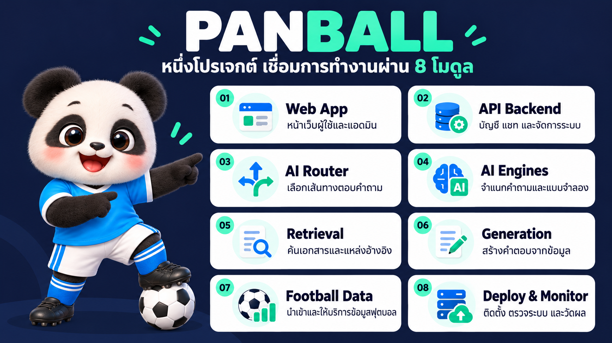
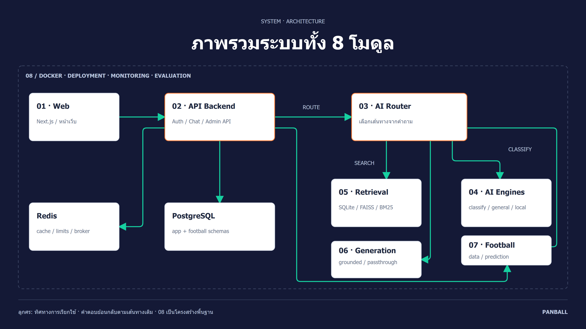

# LAB6 — PANBALL: ผู้ช่วยฟุตบอล AI

โปรเจกต์กลุ่ม Team D-II วิชา Advanced Topics in Computer Software

**ผู้จัดทำส่วนนี้: Peem-Atikorn (Atikorn) · งานหลัก: โมดูล 08 Deploy & Monitoring**


PANBALL รวมการถาม–ตอบเรื่องฟุตบอลพร้อมแหล่งอ้างอิง ผลการแข่งขัน ตารางคะแนน รายงานประจำสัปดาห์ และการทำนาย/จำลองฤดูกาลไว้ในระบบเดียว

## เปิดดูงาน

| รายการ | ลิงก์ |
|---|---|
| โค้ดโปรเจกต์ครบทุกโมดูล | [PANBALL](PANBALL/) |
| งานที่รับผิดชอบและ commit ของตนเอง | [Branch และผลงาน](BRANCHES.md) |
| Branch โมดูล 08 จากรีโปทีม | [codex/panball-08-deploy-peem-atikorn](https://github.com/Peem-Atikorn/ATCS-CPE/tree/codex/panball-08-deploy-peem-atikorn) |
| Branch รวมงานล่าสุดและเครื่องมือ Deploy เพิ่มเติม | [codex/panball-08-deploy-completion](https://github.com/Peem-Atikorn/ATCS-CPE/tree/codex/panball-08-deploy-completion) |
| วิธีรันและตรวจระบบ | [Deploy runbook](PANBALL/deploy/README.md) |
| ผลการวัดต้นฉบับ | [eval/results](PANBALL/eval/results/) |
| ผลตรวจชุดนำส่ง | [VALIDATION.md](VALIDATION.md) |
| สไลด์ผลวัดโมดูล 05 | [PowerPoint](PANBALL/docs/presentations/module05-results/module05-measured-results.pptx) |
| ภาพประกอบพร้อมคำอธิบาย | [ชุดภาพ](PANBALL/docs/presentation-images/) · [คำอธิบาย](PANBALL/docs/presentation-images/คำอธิบายสำหรับพรีเซนต์.md) |
| UML ที่แก้ไขต่อได้ | [PlantUML และหน้าแผนภาพ](PANBALL/docs/diagrams/) |

## งานของตนเอง — โมดูล 08

| งาน | สิ่งที่ทำ | หลักฐาน |
|---|---|---|
| เชื่อมระบบ | Docker Compose สำหรับบริการจริง ฐานข้อมูล Redis และงานเบื้องหลัง | [docker-compose.yml](PANBALL/docker-compose.yml) |
| ตรวจความพร้อม | ตรวจค่าตั้งต้นและค้นหา Docker Desktop บน Windows | [preflight.py](PANBALL/deploy/preflight.py) |
| ติดตามระบบ | ตรวจสถานะ container และ health check รวม worker/beat | [monitor.py](PANBALL/deploy/monitor.py) |
| ตรวจการเชื่อมต่อ | ทดสอบ readiness, login, สิทธิ์ admin และเส้นทางแชท | [smoke.py](PANBALL/deploy/smoke.py) |
| เตรียมข้อมูลสาธิต | นำเข้าข้อมูล รอดัชนี และสร้าง/เผยแพร่รายงาน | [warmup.py](PANBALL/deploy/warmup.py) |
| สรุปผลประเมิน | ประเมินแชทจริงและสร้างรายงานจากผล JSON | [run_live.py](PANBALL/eval/run_live.py) · [build_report.py](PANBALL/eval/build_report.py) |
| คำสั่งใช้งาน | คำสั่งสำหรับ Make และ Windows PowerShell | [Makefile](PANBALL/Makefile) · [tasks.ps1](PANBALL/deploy/tasks.ps1) |
| ตรวจอัตโนมัติ | CI และชุดทดสอบเครื่องมือ deploy | [CI ต้นฉบับ](PANBALL/.github/workflows/deploy-08.yml) · [test_tools.py](PANBALL/deploy/test_tools.py) |

โค้ดโมดูลอื่นเป็นงานร่วมของทีม รายการ commit ของ Atikorn รวมงานช่วยแก้ integration ไว้ใน [BRANCHES.md](BRANCHES.md)
ภาพและสไลด์ใช้ประกอบการอธิบายทั้งระบบ ไม่ใช่การอ้างว่าเขียนทุกโมดูลด้วยตนเอง

## ภาพรวมทั้ง 8 โมดูล



1. **01 Web App** — หน้าเว็บผู้ใช้และผู้ดูแลระบบ
2. **02 API Backend** — บัญชีผู้ใช้ แชท และประสานบริการ
3. **03 AI Router** — เลือกเส้นทางและเตรียมคำค้น
4. **04 AI Engines** — จำแนกคำถามและแบบจำลองทำนาย
5. **05 Retrieval** — ค้นเอกสารด้วย BM25/Vector และรวมอันดับ
6. **06 LLM Generation** — เรียบเรียงคำตอบพร้อมตรวจอ้างอิง/สกอร์
7. **07 Football Data** — นำเข้าและให้บริการข้อมูลฟุตบอล
8. **08 Deploy & Monitoring** — ติดตั้ง ตรวจการเชื่อมต่อ และติดตามระบบ



## ผลการตรวจที่บันทึกไว้

ผลต่อไปนี้เป็นผลจากวันที่ **30 กันยายน 2026** ตาม runbook และไฟล์ผลเดิม ไม่ใช่การรันทดสอบระบบใหม่ในวันอัปโหลด

- Container ทำงานครบ **11/11** และบริการที่มี health check ผ่าน
- Smoke test ผ่าน **15/15** ข้อ (ตรวจการเชื่อมต่อและรูปแบบคำตอบ ไม่ใช่รับรองข้อเท็จจริงทุกคำตอบ)
- Live trivia: เลือก route ถูก **20/20**; พบข้อความคำตอบที่คาดไว้ **17/20** โดยใช้ exact substring matching
- มีผล Retrieval benchmark และผลชุดภาษาไทยแยกใน [eval/results](PANBALL/eval/results/) พร้อมขอบเขตการวัดในสไลด์โมดูล 05

## รันโปรเจกต์

ต้องมี Docker Desktop/Docker Compose และ provider keys ตามฟังก์ชันที่ต้องการใช้
เปิด terminal ในโฟลเดอร์ `LAB6/PANBALL` แล้วทำตาม [Deploy runbook](PANBALL/deploy/README.md)

```powershell
Copy-Item .env.example .env
# แก้ค่ารหัสผ่านและ provider keys ใน .env ก่อนเริ่มระบบ
./deploy/tasks.ps1 preflight
./deploy/tasks.ps1 up
./deploy/tasks.ps1 monitor
./deploy/tasks.ps1 smoke
```

หน้าเว็บ: `http://127.0.0.1:3000` · API: `http://127.0.0.1:8000`
ไฟล์ `.env.example` มีเฉพาะค่าตัวอย่าง ไม่รวม `.env` หรือข้อมูลบัญชีที่ใช้จริง
CI ที่อยู่ใต้ PANBALL เป็นสำเนาต้นฉบับ; workflow จะทำงานอัตโนมัติใน branch ที่มี `.github/workflows` อยู่ที่รากรีโป

## เวอร์ชันที่นำส่ง

- จัดเตรียมวันที่ **8 ตุลาคม 2026**
- Snapshot: `18208d5875d494f2f8e4f8978038ebad78ffe9c8` จาก `peem/08-deploy-completion`
- ต้นทาง: [รีโป Team D-II](https://github.com/sakda1306/Advanced-Topic-in-Computer-Software-Course-Team-D-II)
- โค้ด services 01–07 ตรงกับ `origin/main` และ `origin/develop` ที่ตรวจล่าสุด และคงงาน Deploy/Evaluation เพิ่มเติมในเครื่อง
- ใช้ [SNAPSHOT.json](SNAPSHOT.json) ตรวจ SHA-256 ของไฟล์โค้ดจาก commit ต้นทางได้
- เปิดไฟล์ HTML ในเครื่องเพื่อดูแผนภาพ/รายงานแบบเต็ม; บน GitHub ใช้ภาพ PNG และ Markdown ที่ลิงก์ไว้ด้านบน
